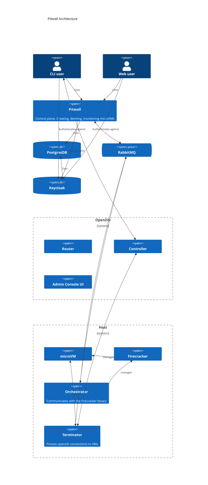

# Overview
A pitwall deployment is made up of three main layers:
 - A web based control plane
 - Infrastructure
 - Host(s) for running the microVMs

 ## Control Plane
 The control plane is written in Rails and provides both a UI for managing VMs, as well as a REST API
 for doing the same. 
 It follows basic Rails conventions and uses async workers for listening to messages off the rabbitMQ
 topics.

 Authentication is handled by keycloak; the control plane will only validate the JWT.

 ## Host Components
 There are two components that reside on a host.

 ### Orchestrator
 The orchestrator is responsible for interfacing with the firecracker binary.  It receives messages from the control plane and based on that will orchestrate the VM using firecrackers API.

For VMs based on a docker image, the orchestrator will download the image, work through the layers of that image to build up a rootFS based on those layers and pass that rootFS on to firecracker.

### Powerunit
A custom linux init.  Sets up the neccessary things (mounts, etc) for running linux and then spins up
an in-process SSH server and any service that it is instructed to do so by the orchestrator.  The powerunit binary is currently injected into the rootFS when it is built by the orchestrator.

 ### Terminator
The terminator will proxy inbound connections over the openZiti overlay to the VMs running on the host.
To make this as seemless as possible, the terminator will listen for VM create events and for each VM
on the host create an openZiti identity, and for each service on the VM that needs to be exposed it will create a matching openZiti service.  This is all done via API calls to the openZiti controller.

### Networking
On each host, the following networking will be set up:
 1. a bridge will be created: `fcbr0`
 2. The bridge will act as a gateway, assigned an IP 172.30.0.1/24
 3. IP table rules are setup
```
    iptables -t nat -A POSTROUTING  -s 172.30.0.0/16 -o wlp2s0 -j MASQUERADE
	iptables -A FORWARD -m conntrack --ctstate RELATED,ESTABLISHED -j ACCEPT
	iptables -A FORWARD -i fcbr0 -o wlp2s0 -j ACCEPT

    TODO: rule to prevent VM to VM communication via host subnet
```
4. For each VM, a TAP interface is created and attached to the bridge.  
   The VM is assigned an IP out of the 172.30.0.0/16 subnet

# Component Communication
Inter-component communication is mostly asynchronous via rabbitMQ using a topic based exchange.

The payload sent/received on the queues are protobufs.

For the terminator it's convienient to use the broker to receive each this message, but a bit inefficient, since we are expecting a terminator instance on the same host as the orchestrator.  Could potentially switch to a more local option (zeroMQ, domain socket, etc)

## Exchange 
`pitwall.orchestration`
## Queues
|Queue Name   |Routing Key  |Description   |
|---|---|---|
|orchestrator.vm.status.web   |orchestrator.vm.status.*   |Used by control plane to listen for status updates   |
|orchestrator.vm.status.terminator.running.`hostname`   |orchestrator.vm.status.RUNNING   |Used by terminator to receive an update when the VM goes to STOPPED state   |
|orchestrator.vm.status.terminator.stopped.`hostname`   |orchestrator.vm.status.STOPPED   |Used by terminator to receive an update when a VM goes to STOPPED state   |

# CLI
Provides basic CLI into pitwall actions.  The most useful would be the SSH command.  This will 
establish an ssh connection over the openZiti network to a VM, using only the VM name.

# Infrastructure
- [RabbitMQ](https://www.rabbitmq.com/): broker
- [Keycloak:](https://www.keycloak.org/) Identity provider

## OpenZiti
[OpenZiti](https://docs.openziti.io/) provides a zero trust overlay network for connecting to the VMs on the host.  This allows
us a way to reach a VM without having to expose anything on the host.  To make this work, there are a few tricks and conventions used by pitwall components.

1. Each VM gets it's own unique identity in the openZiti network.  This is created by the terminator
   on VM create and uses the convention `username`-`vmName`
2. Each service that you want exposed gets its own service in the openZiti network.  This is created   by the terminator.
3. Bind policies are created that allow the user who created the VM to connect to the VM.  This is done by the terminator.
4. An identity is created for the user who creates the VM.  This is done by the CLI, the first time they login with the CLI.  I created it on the CLI side as I felt it was the 'closet' spot to when someone would actually need the identity; to SSH in.  Alternatively, the identity could be created on the first login/registration into the system.  It was also convienient to do it on the CLI, as the openZiti go sdk provides an easy way to enrol the identity programattically.

