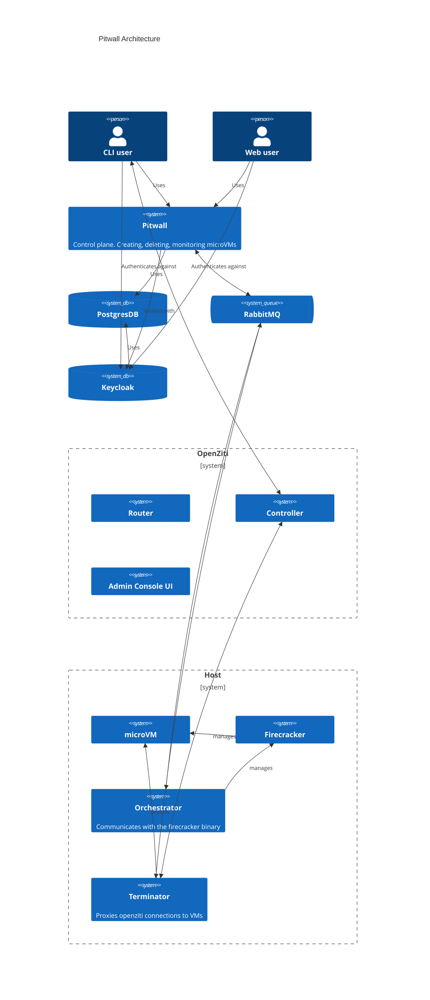

# Overview
A pitwall deployment is made up of three main layers:
 - A web based control plane
 - Infrastructure
 - Host(s) for running the microVMs

# Component Communication
Inter-component communication is mostly asynchronous via rabbitMQ using a topic based exchange.