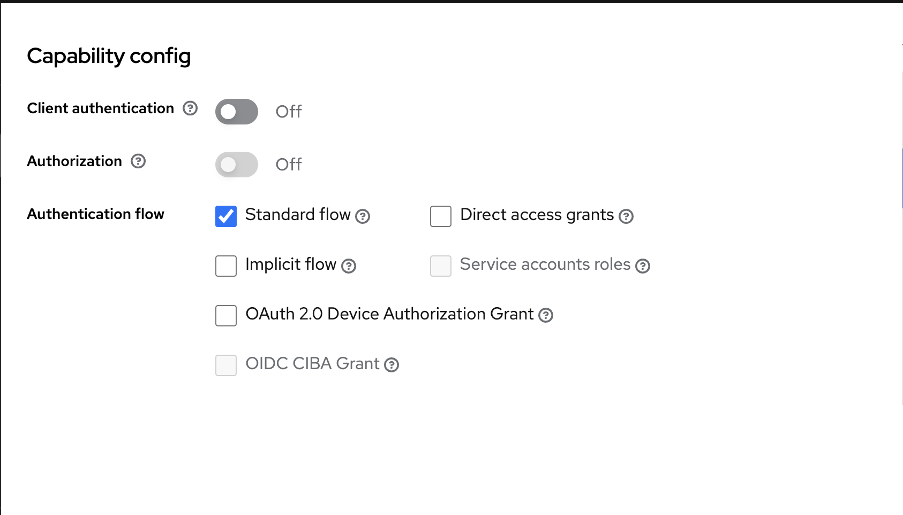

# Pitwall

System for spinning up Firecracker VMs.  The current design is to take a docker image, extract the filesystem, inject a custom init and then spin up the VM.

Tested with: Firecracker v1.1.0

## Components
- Pitwall: a rails based application for managing (creating/deleting) the Firecracker VMs
- Orchestrator: a go based application that runs on the host(s) that will orchestrate the VM
- Powerunit: a go based linux init that is dropped inside VM.  It is lightweight, will currently mount the key directories and provide an SSH server
- CLI: a go based cli for interacting with the pitwall API
- Terminator: a go based proxy for allowing access to the VM via an openziti overlay network

NOTE: For details of how these components work together see ARCHITECTURE.md

### Infrastructure
- Rabbitmq: used for communication between the pitwall app and the orchestrators
- Keycloak: IDP used for authentication
- Postgres: DB for Pitwall and Keycloak
- Openziti: Zero-trust overlay for allowing access to the VMs running on hosts

## Host Networking
Networking on the Firecracker VM hosts currently uses a single bridge device plus iptables for inbound and outbound connections; with each VM connecting to a TAP interface that is attached to the bridge.

This can be setup with:
```
./pitwall --setup
```

### SSH to VM from host
Assuming `id_firecracker` public key is provided when provisioning the VM.

```
ssh -i id_firecracker -p 2222 -o 'PubkeyAcceptedKeyTypes +ssh-rsa' fred@172.30.0.3
```

## Configuration And Running
### Pitwall 
The following environment variables need to be set:
```
KEYCLOAK_URL=
AMQP_SERVER=
AMPQ_PORT=
AMQP_USER=
AMQP_PASSWORD=
AMQP_VHOST=
PITWALL_DB_HOST=
PITWALL_DB_USER=
PITWALL_DB_PASSWORD=
ZITI_CONTROLLER=
ZITI_USER=
ZITI_PASS=
```
- rake db:create
- rake db:migrate
- rake rabbitmq:setup

### Orchestrator 
The following environment variables need to be set:
```
RABBIT_SERVER=
```
- ./pitwall --setup #setup host networking


### Terminator
The following environment variables need to be set:
```
RABBIT_SERVER=
ZITI_CONTROLLER=
ZITI_USER=
ZITI_PASS=
```

The pitwall and powerunit binaries need to be in the same location on the host, and the firecracker binary needs to be on the path.  The terminator binary needs to be run on the each host that has the pitwall binary managing VMs

### Keycloak
 - create database 'keycloak' in postgres
 - create realm 'pitwall'
 - create client 'pitwall-ui'
 
 - create client 'pitwall-cli'
  
  

  ## Building
  The go based projects have makefiles to build locally.  The rails app can be started with `rails s`, worker app can be started with `WORKERS=OrchestratorVmStatusWorker,OrchestratorHealthWorker,OrchestratorHealthCheckWorker bundle exec rake sneakers:run`

  One design decision to note here is that the generated code from the protobufs is done locally and checked in, this can be done with rake/make (depending on which project)

  I have been experimenting with Dagger for CI.  The source code is in `builder` and running `go run . -workDir <base directory>` will trigger a full build that produces images for the web app and the a worker app as well as binaries for the orchestrator and init binary
